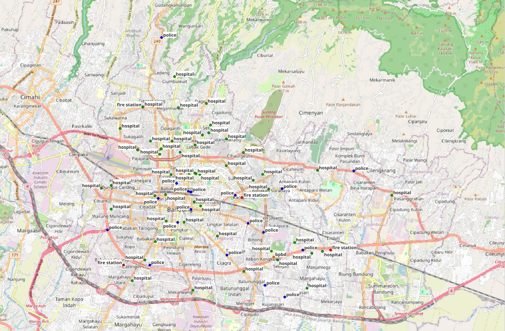
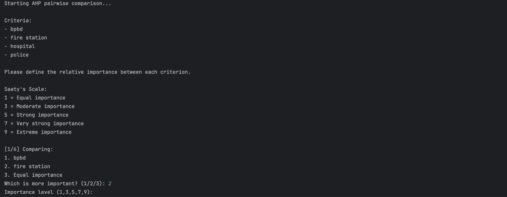
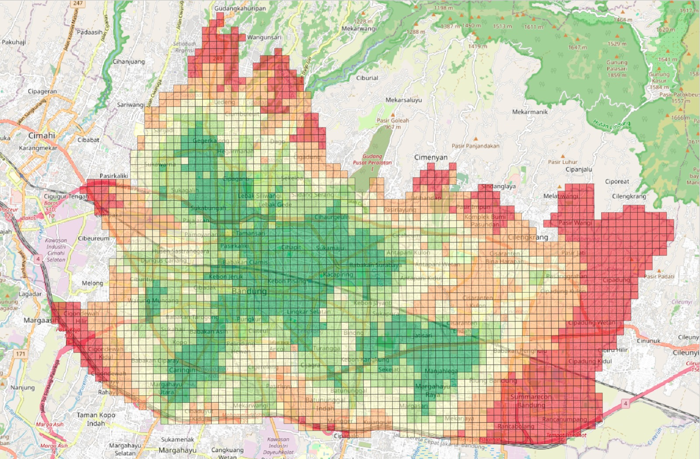

# Spatial Accessibility Analyzer

This repository contains a Python-based tool for performing network-based spatial accessibility analysis using custom Point of Interest (POI) datasets and OpenStreetMap (OSM) road networks.

The workflow combines road network analysis, multi-criteria decision analysis, and spatial aggregation to produce accessibility maps that can support spatial planning and decision-making processes.

The analysis utilizes:

* OpenStreetMap road network data downloaded via OSMnx,
* custom POI datasets provided by the user,
* Analytic Hierarchy Process (AHP) for weighting multiple POI categories,
* network-based shortest path analysis using NetworkX,
* and GeoPandas-based spatial processing and grid aggregation.

The project aims to generate a spatial accessibility surface representing accessibility levels across a study area based on proximity to one or more categories of facilities.

Example use:
To identify areas located far from emergency response facilities in Bandung City, including hospitals, fire stations, police stations, and Regional Disaster Management Agency (BPBD) offices.

The user-defined priority order of facility categories is:
1. Hospitals
2. Fire Stations
3. Police Stations
4. Regional Disaster Management Agency Offices

Custom POIs with user-defined categories used in the accessibility analysis
<p align="center">
  
</p>

AHP pairwise comparison used to determine the relative importance of facility categories
<p align="center">
  
</p>

Accessibility map aggregated into 250 m grid cells based on node accessibility values
<p align="center">
  
</p>

---

# Methodology

The workflow consists of several processing stages:

1. User-defined POI datasets are loaded and projected to a suitable coordinate reference system (CRS).

2. When multiple POI categories are present, users perform pairwise comparisons using the Analytic Hierarchy Process (AHP) to determine the relative importance of each category.

3. Road network data are downloaded from OpenStreetMap using OSMnx and converted into node and edge GeoDataFrames.

4. Custom POIs are integrated into the road network by connecting each POI to its nearest road segment.

5. A NetworkX graph is constructed from the updated nodes and edges.

6. For each POI category:

   * Multi-source Dijkstra shortest path analysis is performed.
   * The shortest network distance from every node to the nearest facility is calculated.

7. Distances are normalized and combined using the user-defined AHP weights to calculate a weighted accessibility index for each network node.

8. Accessibility values are aggregated into regular grid cells using the median accessibility value of all nodes contained within each grid.

9. Empty grid cells are filled using neighboring grid accessibility values.

10. Final accessibility results are exported as a GeoPackage file for further visualization and analysis.

---

# Accessibility Index

For each facility category, network distances are normalized using:

AI_i = 1 - (d_i / d_max)

where:

* AI_i = normalized accessibility value for category i
* d_i = network distance to the nearest facility of category i
* d_max = maximum network distance observed across all categories

The final weighted accessibility index is calculated as:

Accessibility Index = Σ(w_i × AI_i)

where:

* w_i = AHP-derived weight for category i
* AI_i = normalized accessibility value for category i

Higher values indicate better accessibility.

---

# Software and Libraries

* Python
* GeoPandas
* NetworkX
* OSMnx
* Shapely
* NumPy

---

# Repository Structure

```text
├── assets/
│   └── spatial_accessibility_workflow.png
├── data/
│   └── custom_poi_dataset.shp
├── output/
│   └── result_grid.gpkg
├── ahp_process.py
├── merge_poi_graph.py
├── network_accessibility.py
├── main.py
├── requirements.txt
└── README.md
```

---

# User Inputs

The program requires the following inputs:

| Parameter            | Description                                           	 |
| -------------------- | ------------------------------------------------------- |
| PLACE                | Project area name used to download the OSM road network |
| POI_FILE_NAME        | Input POI file located in the data folder             	 |
| POI_CAT_COL_NAME     | Column containing POI categories                      	 |
| POI_CONN_ID_COL_NAME | Column containing unique POI identifiers              	 |
| OUTPUT_NAME          | Output GeoPackage filename                            	 |
| NETWORK_CRS          | Projected CRS used for spatial analysis               	 |

---

# Outputs

The workflow produces a grid-based accessibility map stored as a GeoPackage file.

The output grid contains:

| Field               | Description                          |
| ------------------- | ------------------------------------ |
| grid_id             | Unique grid identifier               |
| accessibility_index | Aggregated accessibility score       |
| node_count          | Number of nodes within the grid cell |
| geometry            | Grid cell geometry                   |


---

# References

1. Boeing, G. (2017).
   *OSMnx: New Methods for Acquiring, Constructing, Analyzing, and Visualizing Complex Street Networks.*
   Computers, Environment and Urban Systems, 65, 126–139.
   https://doi.org/10.1016/j.compenvurbsys.2017.05.004

2. Saaty, T. L. (1980).
   *The Analytic Hierarchy Process.*
   McGraw-Hill, New York.

3. OpenStreetMap Contributors.
   *OpenStreetMap.*
   https://www.openstreetmap.org

4. NetworkX Developers.
   *NetworkX Documentation.*
   https://networkx.org

5. Shapely Development Team.
   *Shapely: Manipulation and Analysis of Geometric Objects.*
   https://shapely.readthedocs.io
